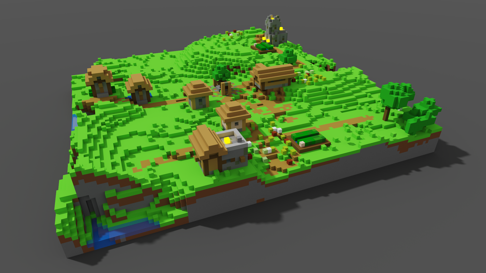

# SchemToVox
Converts WorldEdit `.schem` files into MagicaVoxel `.vox` models.  
Models are capped at 256x256x256.  

Requires the [NBT package](https://pypi.org/project/NBT/).

Usage: `python schem2vox.py schem_file`  
You can also drag the schematic file onto the script.  

I haven't tested every block's colour - some may look strange; should be an easy fix.

## Examples

 

 

 

 
