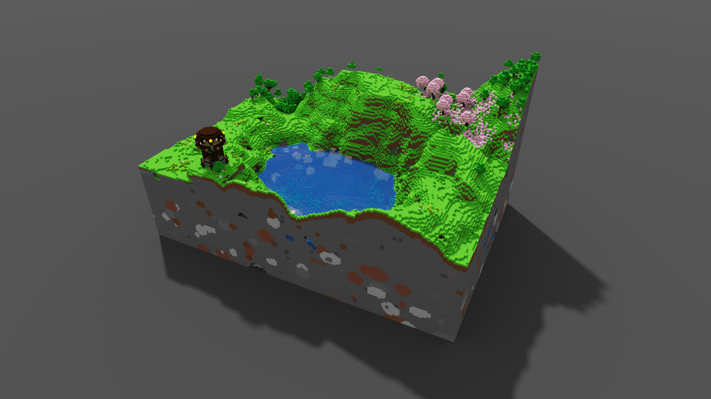

# SchemToVox
Converts WorldEdit schematic (`.schem`) files into MagicaVoxel voxel (`.vox`) models.  
You can make schematic files by creating a selection with the wand (or `//pos1`-`//pos2`), running `//copy` and then `//schem save <schematic_filename>`.  
The saved `.schem` file will be in your `.minecraft/config/worldedit/schematics` directory.  
Models are capped at 2000x2000x1000 voxels. For large schematic captures I'd recommend a local [Paper server](https://papermc.io/) running [FastAsyncWorldEdit](https://www.spigotmc.org/resources/fastasyncworldedit.13932/).  

**Requires the [NBT package](https://pypi.org/project/NBT/).**

Usage: `python schem2vox.py <parameters> schem_file`  
You can also drag the schematic file onto the script. 

### Parameters
- `-o`/`--outfile` `<filename>`:  
Sets the name of the file to write the output to.  
Defaults to `out.vox`.

- `-c`/`--compression` `<value from 0 to 10>`:  
Will merge similar colours - a higher value means a lower threshold for merging.  
May be desirable for larger or more detailed schematics.  

- `-u`/`--cull`:  
Will remove any invisible voxels (voxels with every face covered by an opaque voxel).  
Significantly decreases filesize for larger schematics, though will increase processing time.  

- `-t`/`--truncate`:  
Will discard as many block types as needed to fit into the 256-colour palette.  
Keeps the 256 most-used blocks.  
May be required for larger or more detailed schematics.  

## Examples

 

 

 

 

 

